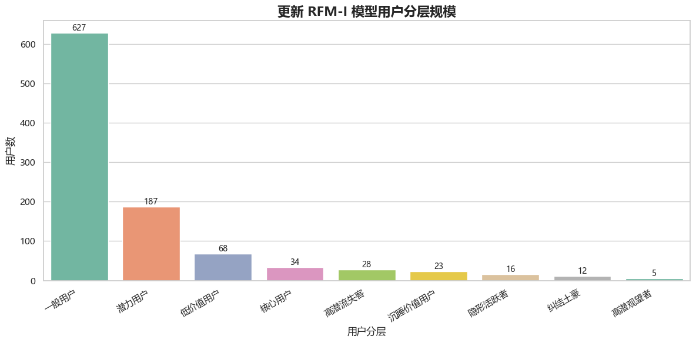
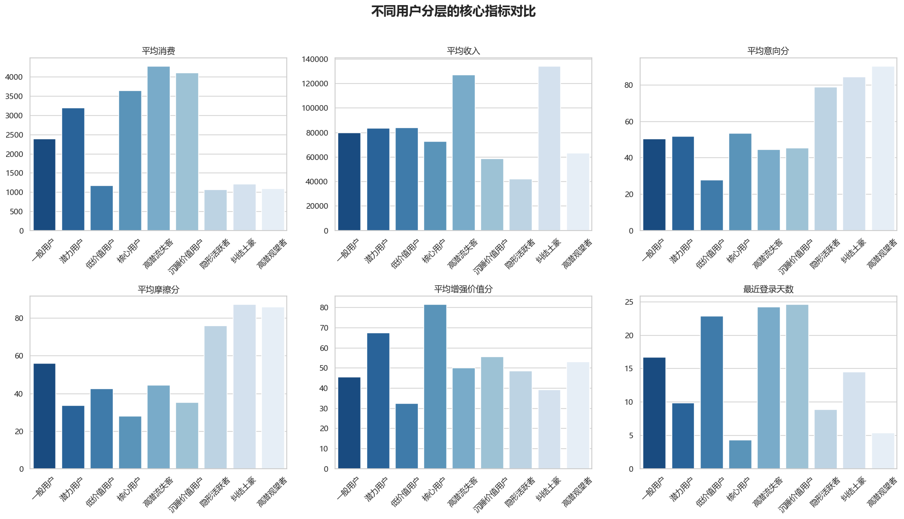
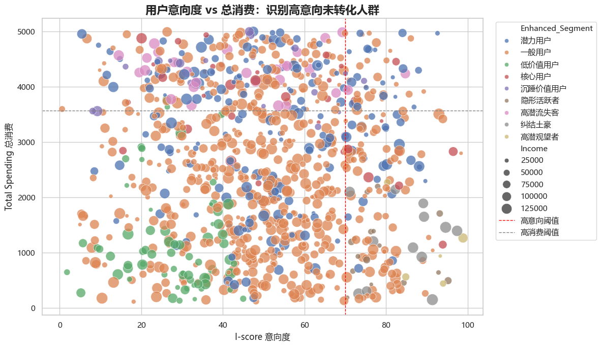
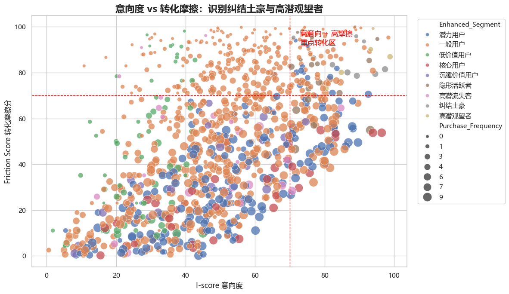
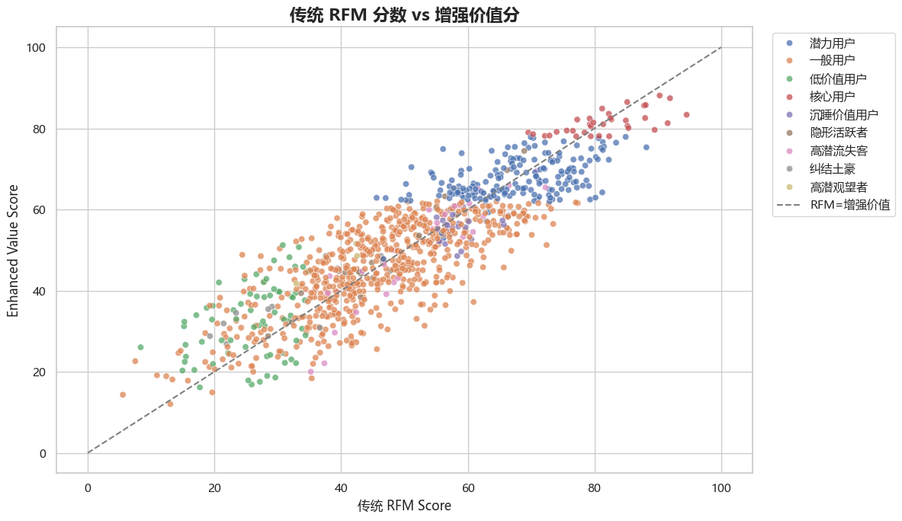
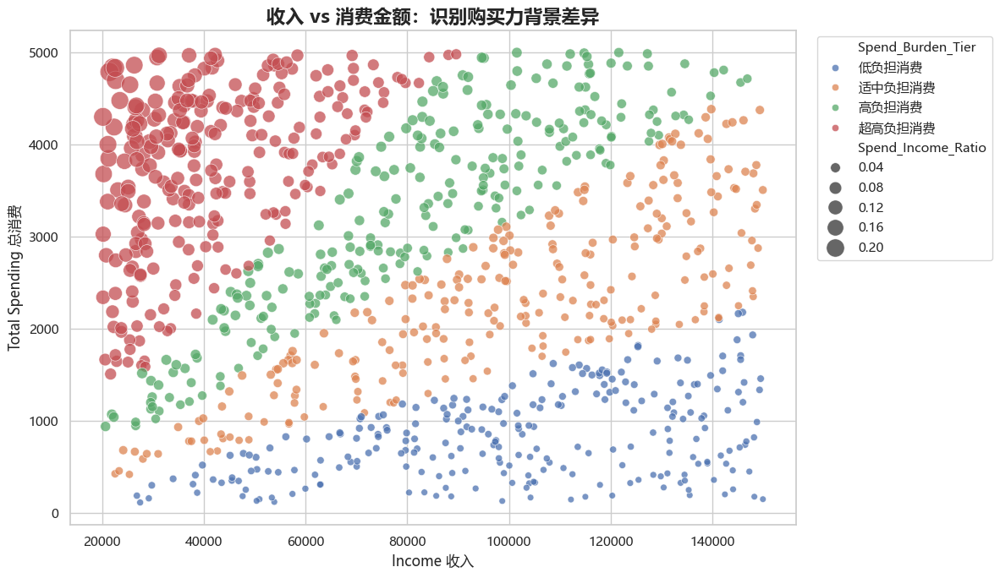
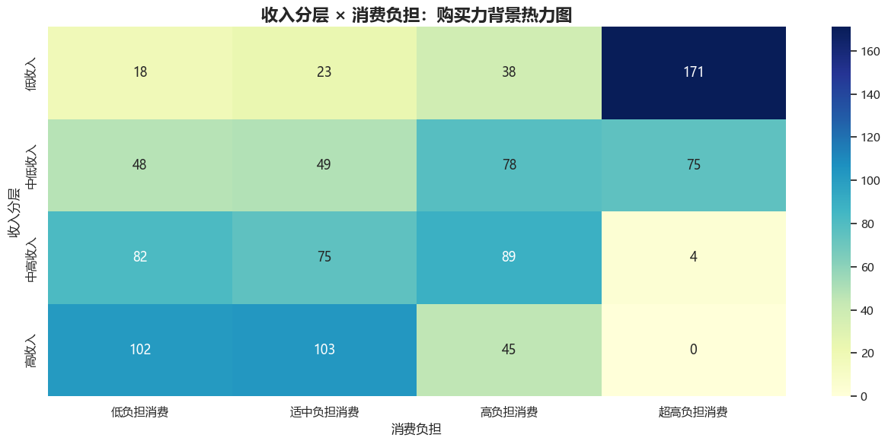
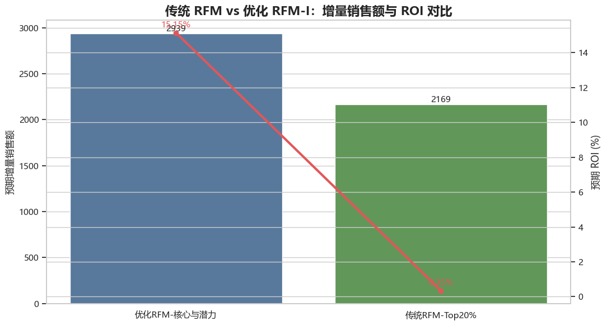
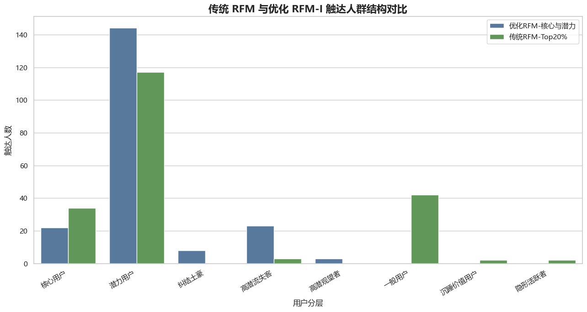

# 电商用户价值分层与精准营销策略图文报告

## 一、项目背景

在电商运营中，传统用户价值评估常依赖 RFM 模型，即最近一次行为、购买频次和消费金额。该方法能够快速找到历史消费能力较强的用户，但它主要解释“过去谁买得多”，对“现在谁更想买”“谁看了很多却没买”“谁正在流失”“谁有购买力但缺少合适商品”等问题识别不足。

本项目基于 `user_personalized_features.csv` 共 1000 名用户数据，在传统 RFM 的基础上引入意向度、转化摩擦、活跃连接度和购买力背景标签，构建优化后的 RFM-I 用户价值分层模型，并进一步提出分层营销策略和 ROI 对比实验。

本报告的核心目标是：把用户从简单的“高价值/低价值”划分，升级为可运营、可触达、可转化的用户画像体系。

## 二、传统 RFM 策略的不足

传统 RFM 策略通常把优惠券投放给 RFM 排名前 20% 的用户。这种做法简单直接，但存在明显问题：

1. 容易补贴本来就会购买的用户，导致营销预算浪费。
2. 难以识别“天天逛、停留久、浏览多，但就是不买”的高潜观望者。
3. 难以识别“收入高、意向强、但选择成本高”的纠结土豪。
4. 难以区分行为忠诚与名义忠诚，例如订阅了但长期不登录的用户。
5. 无法体现购买力差异，同样消费 1000 元，对高收入用户和低收入用户的含义完全不同。

因此，本项目不是否定 RFM，而是在 RFM 的基础上补充行为意向、转化阻力和购买力背景，让模型更接近真实运营场景。

## 三、优化 RFM-I 模型设计

### 1. 传统 RFM 维度

- R-score：最近登录越近，得分越高。
- F-score：购买次数越多，得分越高。
- M-score：总消费金额越高，得分越高。
- RFM 综合分 = 0.35 × R + 0.30 × F + 0.35 × M。

### 2. 新增修正因子

- 意向度 I-score = 停留时长分位分 × 0.5 + 浏览页数分位分 × 0.5，用于衡量用户“想不想买”。
- 转化摩擦系数 = 浏览页数 /（购买次数 + 1），用于衡量用户“看了多少页才买一次”，分值越高说明越纠结。
- 活跃连接度：结合订阅状态与最近登录天数，区分高连接、中连接、名义忠诚、弱连接和低连接用户。
- 购买力背景：基于收入分层和消费/收入比例形成标签，不进入综合得分，但用于修正营销动作。

### 3. 增强价值分

增强价值分 = 0.55 × RFM + 0.25 × I-score + 0.20 ×（100 - 摩擦分）+ 活跃连接修正 + 高/低摩擦修正。

该设计的含义是：历史价值仍然重要，但用户当前意向、转化阻力和活跃连接状态也会显著影响营销优先级。

## 四、用户分层结果

更新模型共识别出以下用户群体：一般用户627人、潜力用户187人、低价值用户68人、核心用户34人、高潜流失客28人、沉睡价值用户23人、隐形活跃者16人、纠结土豪12人、高潜观望者5人。

| 用户分层 | 用户数 | 平均消费 | 平均收入 | 平均意向分 | 平均摩擦分 | 平均增强价值分 | 最近登录天数 |
| --- | --- | --- | --- | --- | --- | --- | --- |
| 一般用户 | 627 | 2393.73 | 79697.40 | 50.40 | 56.03 | 45.47 | 16.68 |
| 潜力用户 | 187 | 3194.65 | 83704.19 | 51.94 | 33.76 | 67.51 | 9.84 |
| 低价值用户 | 68 | 1172.76 | 83971.90 | 27.89 | 42.65 | 32.47 | 22.84 |
| 核心用户 | 34 | 3643.88 | 72581.03 | 53.63 | 27.96 | 81.41 | 4.29 |
| 高潜流失客 | 28 | 4273.89 | 126868.14 | 44.54 | 44.58 | 50.18 | 24.21 |
| 沉睡价值用户 | 23 | 4102.83 | 58787.61 | 45.31 | 35.25 | 55.69 | 24.57 |
| 隐形活跃者 | 16 | 1062.31 | 42306.06 | 78.80 | 76.18 | 48.56 | 8.88 |
| 纠结土豪 | 12 | 1212.33 | 133819.00 | 84.63 | 87.26 | 39.14 | 14.50 |
| 高潜观望者 | 5 | 1094.40 | 63358.00 | 90.22 | 85.93 | 53.12 | 5.40 |

*图1 更新 RFM-I 模型用户分层规模*

从分层规模看，一般用户仍然占比最高，说明大部分用户特征尚不突出，需要通过自动化运营继续观察其迁移方向。潜力用户达到 187 人，是后续转化和培养的主要对象。核心用户、高潜流失客、纠结土豪、高潜观望者虽然人数较少，但运营价值更集中，适合采用更精细的触达策略。

*图2 不同用户分层的核心指标对比*

图2 展示了不同分层在消费、收入、意向、摩擦和增强价值上的差异。高潜流失客平均消费和平均收入较高，但最近登录天数偏长，说明其价值高但存在流失风险。纠结土豪收入和意向都高，但消费偏低、摩擦分很高，说明他们不是没钱，而是决策链路没有被打通。高潜观望者意向和摩擦都很高，是传统 RFM 最容易漏掉的新增重点人群。

## 五、关键可视化洞察

### 1. 意向度与消费金额

*图3 用户意向度 vs 总消费*

图3 用意向度和总消费金额交叉观察用户。右下区域代表高意向但低消费用户，这类用户对平台有明显兴趣，却没有形成足够消费，是首单券、品类券、足迹召回和精准推荐的重点对象。右上区域则代表高意向高消费用户，适合做会员权益和复购经营。

### 2. 意向度与转化摩擦

*图4 意向度 vs 转化摩擦*

图4 右上角是高意向、高摩擦用户，典型包括纠结土豪和高潜观望者。这类用户已经表现出较强购买意愿，但购买路径中存在选择障碍、价格犹豫、商品匹配不足或信任不足。对他们的营销重点不是简单发大额优惠券，而是降低决策成本，例如商品对比、榜单推荐、专家导购、套装方案、降价提醒和小额限时激励。

### 3. 传统 RFM 与增强价值分

*图5 传统 RFM 分数 vs 增强价值分*

图5 展示了传统 RFM 与增强价值分之间的差异。部分用户传统 RFM 分不高，但增强价值分明显更高，说明他们可能具有当前意向、活跃连接或转化潜力。优化模型的价值正在于把这些传统模型低估的人群识别出来。

### 4. 购买力背景差异

*图6 收入 vs 消费金额*

图6 说明同样的消费金额对不同收入用户意义不同。高收入用户花费 1000 元可能只是低负担消费，而低收入用户花费 1000 元可能已经是较高投入。因此，收入不应直接进入主价值分，否则容易把“有钱但无需求”的用户误判为高价值；但收入必须作为运营修正标签，用于决定商品价格带、优惠力度和沟通方式。

*图7 收入分层 × 消费负担热力图*

图7 将收入分层与消费负担结合，帮助运营团队区分不同购买压力下的用户。高收入低负担用户适合推高客单和品质升级；低收入高负担用户更适合低门槛优惠、分期、平价替代品和忠诚权益。

## 六、分层用户画像与精准营销策略

| 用户分层 | 用户数 | 平均消费 | 平均收入 | 平均意向分 | 平均摩擦分 | 营销建议 |
| --- | --- | --- | --- | --- | --- | --- |
| 潜力用户 | 187 | 3194.65 | 83704.19 | 51.94 | 33.76 | 围绕最近偏好类目做精准推荐，用阶梯满减和连续购买奖励把偶发消费变成习惯消费。 |
| 核心用户 | 34 | 3643.88 | 72581.03 | 53.63 | 27.96 | 会员等级、专属新品、加价购、组合套装和复购周期提醒，提高客单价和复购频次。 |
| 高潜流失客 | 28 | 4273.89 | 126868.14 | 44.54 | 44.58 | 优先召回并诊断流失原因，提供专属客服、个性化挽留券、新品优先体验。 |
| 隐形活跃者 | 16 | 1062.31 | 42306.06 | 78.80 | 76.18 | 鼓励分享裂变、评价晒单、内容互动；消费侧用低价爆品和拼团提升频次。 |
| 纠结土豪 | 12 | 1212.33 | 133819.00 | 84.63 | 87.26 | 先降低决策成本：个性化榜单、同价位对比、专家推荐、套装方案，再给小额限时券。 |
| 高潜观望者 | 5 | 1094.40 | 63358.00 | 90.22 | 85.93 | 用低门槛首单券、足迹召回、购物车提醒和爆品推荐，促成首次或下一次购买。 |

### 1. 核心用户

核心用户增强价值分最高，近期活跃度较好，是平台当前最稳定的利润来源。运营重点不是盲目给大额券，而是通过会员等级、专属新品、加价购、组合套装和复购提醒提升客单价与复购频次。对这类用户，低折扣但高感知的权益往往比直接降价更有效。

### 2. 潜力用户

潜力用户是从普通用户向核心用户迁移的关键群体。其消费和活跃表现已经具备基础，但购买习惯尚未完全稳定。应围绕其最近浏览或购买偏好做精准推荐，并使用阶梯满减、第二件优惠、连购奖励等方式，把偶发消费转化为稳定复购。

### 3. 高潜流失客

高潜流失客收入高、历史消费高，但近期活跃下降。该群体如果流失，损失较大，应优先触达。建议先进行流失原因诊断，再提供专属召回券、客服一对一、老客回归礼包、新品优先体验等挽留方案。

### 4. 纠结土豪

纠结土豪有钱、有意向，但消费低、摩擦高。说明他们并非没有购买力，而是没有找到合适商品或缺少足够决策信心。运营应先提供高匹配商品推荐、同价位对比、专家推荐、品质保障和套装方案，再用小额限时券推动成交。

### 5. 高潜观望者

高潜观望者是新增模型重点识别的人群。他们经常浏览、停留时间长、页面浏览多，但购买少。对这类用户，目标应是先完成交易闭环，可以使用首单券、低门槛品类券、浏览商品降价提醒、购物车召回和爆品推荐。

### 6. 隐形活跃者

隐形活跃者意向高但收入和消费较低，可能更像内容粉丝或价格敏感型用户。对他们不适合强推高价商品，应鼓励分享裂变、评价晒单、内容互动、拼团和低价爆品复购，让其贡献传播价值和低成本订单。

## 七、ROI 对比实验

实验设计如下：

- 传统 RFM 策略：将优惠券发给 RFM_Score 前 20% 用户。
- 优化 RFM-I 策略：将优惠券发给核心用户、潜力用户、纠结土豪、高潜观望者和高潜流失客。
- 两组触达人数均为 200 人，券面预算均为 2000。
- 原始数据没有真实营销曝光和转化结果，因此本报告使用行为代理模型估算预期 ROI，正式上线时应使用 A/B 实验真实数据替代。

| 实验组 | 触达用户数 | 券面预算 | 平均RFM | 平均增强价值分 | 平均券增量率 | 预期核销成本 | 预期增量销售额 | 预期增量利润 | 预期ROI |
| --- | --- | --- | --- | --- | --- | --- | --- | --- | --- |
| 优化RFM-核心与潜力 | 200 | 2000.00 | 65.41 | 65.87 | 0.05 | 725.66 | 2938.78 | 302.91 | 0.15 |
| 传统RFM-Top20% | 200 | 2000.00 | 73.23 | 68.65 | 0.04 | 752.33 | 2169.34 | 6.94 | 0.00 |

*图8 传统 RFM 与优化 RFM-I 的 ROI 对比*

从 ROI 结果看，优化 RFM-I 策略在同等预算下的预期增量销售额为 2938.78，高于传统 RFM 的 2169.34，增量差额为 769.44。预期增量利润从传统策略的 6.94 提升到 302.91，提升 295.97。预期 ROI 从 0.0035 提升到 0.1515，约为传统策略的 43.7 倍。

*图9 传统策略与优化策略触达人群结构对比*

图9 表明，两种策略触达的人群结构明显不同。传统 RFM 更偏向历史消费和综合 RFM 排名靠前的人，而优化策略会把预算更多分配给核心、潜力、纠结、高潜观望和高潜流失等更可能产生增量的人群。这正是优化模型相较传统模型的主要价值。

## 八、最终结论

1. 传统 RFM 能够识别历史高价值用户，但容易忽略高意向未转化、浏览纠结、活跃下降和购买力背景差异。
2. 优化 RFM-I 模型通过意向度、转化摩擦、活跃连接度和购买力背景标签，让用户分层更接近真实运营场景。
3. 纠结土豪、高潜观望者、高潜流失客是传统模型不容易看见但极具运营价值的人群。
4. 营销策略应从“给高价值用户发券”升级为“针对不同用户阻力设计不同转化动作”。
5. ROI 对比显示，在相同预算下，优化 RFM-I 策略比传统 Top20% RFM 投放更能带来预期增量收益。

## 九、落地建议

- 第一优先级：高潜流失客。及时召回，避免高价值用户流失。
- 第二优先级：纠结土豪与高潜观望者。通过精准推荐和决策辅助促成转化。
- 第三优先级：核心用户与潜力用户。用会员权益、复购提醒和组合套装提升客单价。
- 第四优先级：隐形活跃者。以分享裂变、低价爆品和低成本互动为主。
- 长期机制：持续追踪用户在不同分层之间的迁移，并用真实 A/B 实验数据校准 ROI 模型。

